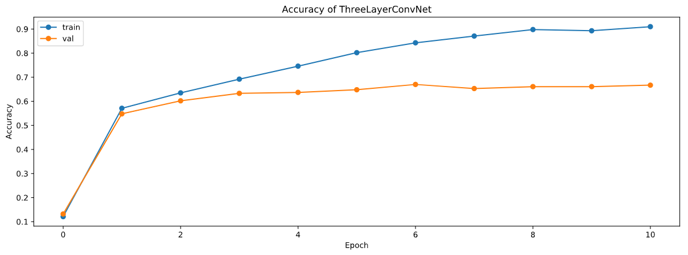
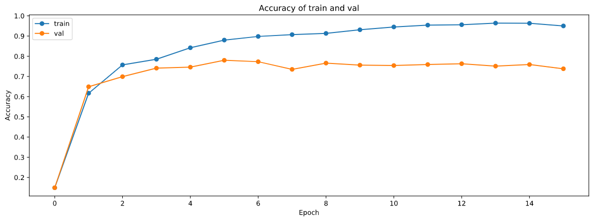
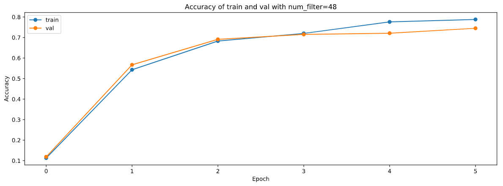
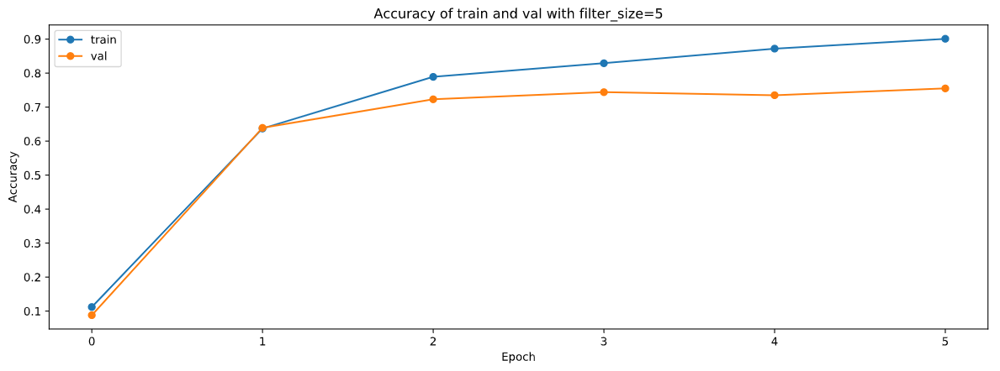
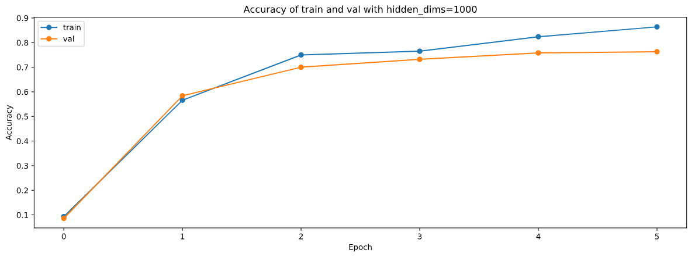
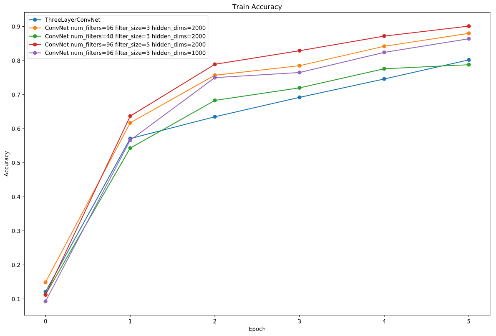
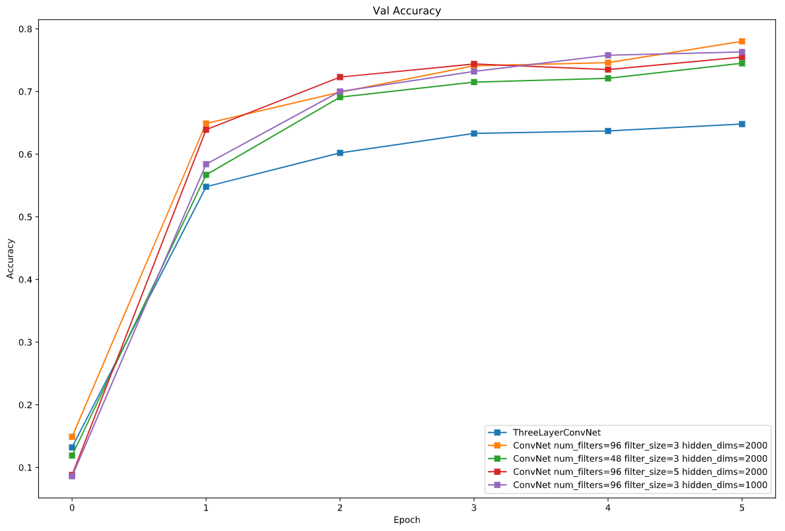
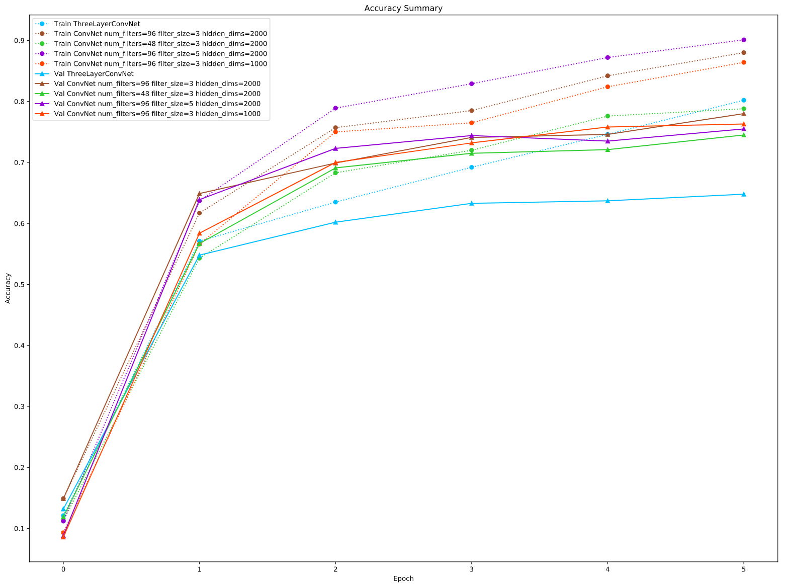

<h1 align=center>ConvNet实验报告</h1>

<h1 align=center>18340052  何泽</h1>

## 一、要求

> **Train your best model**
>
> Try to get the best performance that you can on CIFAR-10 using a ConvNet. You can try some different parameters or add batch/layer normalization and dropout layer which are completed in annp/layers.py into your model for faster training.
>
> **Things you can try:**
>
> - Filter size: Different filters can extract different degree of image features
>
> - Number of filter: Do more or fewer better ?
>
> - Network architecture: The network above has two layers of trainable parameters. Can you do better with deeper network ? You can implement alternative architecture in the file annp/classifiers/cnn.py.
>
> **Expectation**
>
> At last, you should be expected to train a ConvNet that gets at least 60% accuracy on the validation set.   
>
> You should use the space below to experiment and train your network. The final cell should contain the training, validation and test set accuracies for your final trained network.   
>
> You should write a report about what you did, any additional features that you implemented and any visualizations or graphs on evaluating your network.
>
> **Attention**
>
> You should not be allowed to use any deep learning framework !!!

## 二、三层网络

首先，为了对比，我训练了上面已经实现过的三层网络，并将学习率由1e-3调小到1e-4，然后训练了10轮，可以看到结果如下：



在训练集上准确率最高83.91%，测试集上最高67%，此时其实已经达到了60%准确率的要求，不过接下来我将增加网络的层数，改变结构，并在之后的版本上讨论Filter size和filter大小的影响。

## 三、ConvNet

### 1. 模型架构

之前的三层网络结构是`conv - relu - max pool - affine - relu - affine - softmax`，我准备再加一层卷积层并将后一个纺射层删除，即更改之后的结构是这样的：`conv - relu - conv - relu - max pool - affine - relu - softmax`，实现为`cnn.py`的`ConvNet`类。

### 2. 代码解读

和前面一样依然作用于(N,C,H,W)的minibatch，即N个图像，C条通道，长宽为H和W。

首先是一些初始化：

- 首先初始化参数并定义维度

    ```python
    self.params = {}
    self.bn_params = {}
    self.spatialbn_params = {}
    self.use_bn = use_batchnorm
    self.reg = reg
    self.dtype = dtype
    self.filter_size = filter_size
    self.conv_layers = conv_layers
    self.affine_layers = affine_layers
    C,H,W = input_dim
    F = filter_size
    pad = (F-1)//2
    pool_S = 2
    H2,W2 = H,W
    ```

- 然后初始化卷积层的权重、偏置量和归一化的参数（$\gamma$ 、$\beta$ 以及平均值与方差）

    ```python
    for l in range(2*conv_layers):
        self.params['W%d' % (l+1)] = np.random.randn(num_filters,C,F,F) * weight_scale
        self.params['b%d' % (l+1)] = np.zeros(num_filters)
        C = num_filters
        if(l % 2 == 1 and l != 0):
            H2,W2 = [(H2+2*pad-F)//pool_S + 1, (W2+2*pad-F)//pool_S + 1]
            if(self.use_bn is True):
                self.params['gamma%d' % (l+1)] = np.ones(C)
                self.params['beta%d' % (l+1)] = np.zeros(C)
                self.spatialbn_params['running_mean'] = np.zeros(num_filters)
                self.spatialbn_params['running_var'] = np.zeros(num_filters)
    ```

- 和上面类似，接下来初始化纺射层的参数（权重、偏置量、$\gamma$ 、$\beta$ 以及平均值与方差）

    ```python
    if(affine_layers == 1):
        hidden_dims = [H2*W2*num_filters] + [hidden_dims] + [num_classes]
    else:
        hidden_dims = [H2*W2*num_filters] + hidden_dims + [num_classes]
    
    for l in range(affine_layers+1):
        self.params['W%d' % (l+2*conv_layers+1)] = np.random.randn(hidden_dims[l],hidden_dims[l+1]) * weight_scale
        self.params['b%d' % (l+2*conv_layers+1)] = np.zeros(hidden_dims[l+1])
        if(self.use_bn is True and l != affine_layers):
            self.params['gamma%d' % (l+2*conv_layers+1)] = np.ones(hidden_dims[l+1])
            self.params['beta%d' % (l+2*conv_layers+1)] = np.zeros(hidden_dims[l+1])
            self.bn_params['running_mean'] = np.zeros(hidden_dims[l+1])
            self.bn_params['running_var'] = np.zeros(hidden_dims[l+1])
    ```

- 然后将参数类型转变为浮点型：

    ```python
    for k, v in self.params.items():
        self.params[k] = v.astype(dtype)
    ```

接下来计算loss和梯度：

- 先对卷积层和池化层的前向传播的一些参数赋值

    ```python
    filter_size = self.filter_size
    conv_param = {'stride': 1, 'pad': (filter_size - 1) / 2}
    pool_param = {'pool_height': 2, 'pool_width': 2, 'stride': 2}
    ```

- 计算出前向传播的层数

    ```python
    total_layers = conv_layers+affine_layers+1
    ```

- 然后进行前向传播

    ```python
    for l in range(total_layers):
        # 卷积层
        if(l < conv_layers): 
            conv_a, conv_cache[2*l+1] = conv_relu_forward(
                conv_a, self.params['W%d' % (2*l+1)], self.params['b%d' % (2*l+1)], conv_param)
            conv_a, conv_cache[2*l+2] = conv_relu_pool_forward(
                conv_a, self.params['W%d' % (2*l+2)], self.params['b%d' % (2*l+2)], conv_param, pool_param)
            if(l == conv_layers-1):
                fp_check = True
    	# 纺射层
        else:
            if(fp_check is True):
                fp_check = False
                N,num_F,H,W = conv_a.shape
                fc_a = np.reshape(conv_a,(N,num_F*H*W))
            if(l == total_layers-1):
                scores, fc_cache[l] = affine_forward(
                    fc_a, self.params['W%d' % (2*conv_layers+l-1)], self.params['b%d' % (2*conv_layers+l-1)])
            else:
                fc_a, fc_cache[l] = affine_forward(
                    fc_a, self.params['W%d' % (2*conv_layers+l-1)], self.params['b%d' % (2*conv_layers+l-1)])
    if y is None:
                return scores
    ```

- 使用softmax计算loss和delta_l

    ```python
    loss, delta_l = softmax_loss(scores,y)
    ```

- 然后反向传播

    ```python
    # 反向传播
    for l in range(total_layers-1,-1,-1):
        # 纺射层
        if(l >= conv_layers):                
            delta_l, grads['W%d' % (2*conv_layers+l-1)], grads['b%d' % (2*conv_layers+l-1)] = affine_backward(delta_l, fc_cache[l])
            if(l == conv_layers):
                delta_l = np.reshape(delta_l, (N,num_F,H,W))
        # 卷积层
        else:
            delta_l, grads['W%d' % (2*l+2)], grads['b%d' % (2*l+2)] = conv_relu_pool_backward(delta_l, conv_cache[2*l+2])
            delta_l, grads['W%d' % (2*l+1)], grads['b%d' % (2*l+1)] = conv_relu_backward(delta_l, conv_cache[2*l+1])
    ```

- 计算loss、grads

    ```python
    for l in range(total_layers):
        if(l < conv_layers):
            W1 = self.params['W%d' % (2*l+1)]
            W2 = self.params['W%d' % (2*l+2)]
            loss += 0.5*self.reg*(np.sum(W1*W1)+np.sum(W2*W2))
            grads['W%d' % (2*l+1)] += self.reg*W1
            grads['W%d' % (2*l+2)] += self.reg*W2
        else:
            W = self.params['W%d' % (2*conv_layers+l-1)]
            loss += 0.5*self.reg*np.sum(W*W)
            grads['W%d' % (2*conv_layers+l-1)] += self.reg*W
            
    return loss, grads
    ```

以上便是我的ConvNet。

## 三、网络的训练

接下来便开始训练网络，对于学习率，我是先试了几个，最后决定在前面1e-4的基础上稍微调大一些，设为了0.00015；而lr_decay设为了0.99，也就是每过一轮学习率乘0.99。

而对于filter的大小和数量以及隐藏层的维度，我准备接下来设置不同的参数训练进而对比结果。

### 1. num_filters=96, filter_size=3, hidden_dims=2000

因为是第一次训练，所以我训练了较多轮（15轮），结果如下：



最终在训练集上准确率为87.91%，测试集上准确率为78%。**（提前说一下，这是最好的结果）**

同时可以看到在训练到第5、6轮左右的时候测试集上准确率达到最高，在这之后便出现了过拟合的情况，即虽然在训练集上准确率提高但是在测试集上的准确率不增反降，由于训练一轮比较久为了节省时间所以我决定后面的网络都只训练5轮。

### 2. num_filters=48 filter_size=3 hidden_dims=2000

将filter的大小由96调小至48，其余不变，结果如下：



最终在训练集上准确率为79.37%，测试集上准确率为74.5%。

### 3. num_filters=96 filter_size=5 hidden_dims=2000

将filter_size由3增加至5，其余不变，结果如下：



最终在训练集上准确率为85.72%，测试集上准确率为76.3%。

### 4. num_filters=96 filter_size=3 hidden_dims=1000

将隐藏层维度由$2000\times2000$减小为$1000\times1000$，其余不变，结果如下：



最终在训练集上准确率为86.4%，测试集上准确率为76.3%。

## 四、结果分析

将上面各参数的结果汇总，并将最开始的三层网络的训练结果也放进来作为对比，在训练集上对比如下：



可以看出在训练集上，filter的大小、数量以及隐藏层维度都是越大效果越好，同时和三层网络的结构的差别并不是特别地大，甚至在第五轮的时候准确率超过了num_filters为48的情况。

在测试集上如下：



在测试集上三层网络和我的网络的结果就相差很多了，有着10%以上的准确率的差距，但是各参数的结果的差距就小了很多。

然后将以上结果全部汇总分析各参数的影响：



由此可以得出以下结论：

- 因为无论在训练集还是测试集上num_filters为48的效果都是最差的，所以filter的数量即num_filters的确是大一些比较好
- 对于filter_size，虽然为5的时候在训练集上表现最好但是在测试集上却只比num_filters为48的好，而且这也会增加训练时间但并不会获得一个更好的实验结果，所以filter_size并不是越大或越小就越好，要找一个合适的大小
- 对于隐藏层的维度大小同样为大一些比较好
- 另外，对比三层网络的结构提升的确比较大，测试集上的准确率由67%提升到了78%，说明`conv - relu - conv - relu - max pool - affine - relu - softmax`的结构的确要比`conv - relu - max pool - affine - relu - affine - softmax`的结构要好。


以上便是我对于网络架构与参数、实验结果的分析，在最好的参数下（num_filters=96, filter_size=3, hidden_dims=2000 即第一次训练的结果），在训练集上最高有87.91%的准确率，在测试集上有78%的准确率。